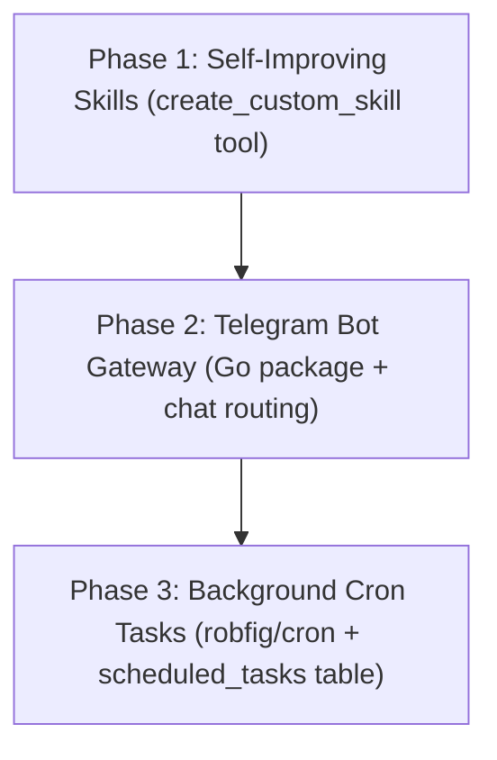

# Proposal: Hermes Agent Research & Distillation for Cozyroom

## Origin
- **Source**: User request to research Nous Research Hermes Agent and distill features into Cozyroom.
- **Date**: 2026-05-28
- **Context**: Dynamic comparison between the state-of-the-art Hermes Agent CLI and Cozyroom's existing `AIAgentRuntime` architecture.

---

## 1. Research Overview: What makes Hermes Agent unique?

**Hermes Agent** (developed by Nous Research) is an open-source, autonomous, and persistent developer assistant operating primarily via a CLI/TUI. Its key strengths are:

1. **Self-Improving Skills**: When Hermes solves complex workflows, it distills them into reusable skill files (recipes) that it can reference and execute in future turns, compounding its capabilities over time.
2. **Multi-Platform Gateway**: It acts as a bridge, allowing users to interact with their personal agent via terminal CLI, TUI, or external chat platforms (Telegram, Discord, Slack, WhatsApp).
3. **Autonomous Task Automation (Cron)**: It can register and execute unattended tasks (e.g., system checks, data processing) using scheduling and background cron executors.
4. **Editor and Protocol Agnostic**: Integrates with IDEs via the Agent Client Protocol (ACP) and supports Model Context Protocol (MCP) to extend its capabilities.

---

## 2. Gap Analysis: Cozyroom vs Hermes

Currently, Cozyroom has an extremely advanced **AI Agent Runtime** (documented in [[AIAgentRuntime]] and [[MCPServer]]) that already shares some architecture patterns with Hermes, but also leaves exciting opportunities:

| Capability | Cozyroom AI Agent Runtime | Hermes Agent | Cozyroom Gap / Opportunity |
|---|---|---|---|
| **Persistent Memory** | SQLite `agent_memory` (remember/recall/forget) + System Prompt injection | Persistent SQLite storage for preferences and long-term memory | **Fully Implemented** (Cozyroom memory is already equivalent for user facts). |
| **Skill Extensibility** | Static `llmwiki/skills/` markdown guides, manually curated and structured | **Self-improving skills**: dynamically writes and persists new skill recipes to disk | **Gap**: Cozyroom agent cannot dynamically create or upgrade its own skills. |
| **Interface & Access** | React Web UI Chat Tab only | Terminal TUI, CLI, and Messaging bots (Telegram, Discord, Slack) | **Gap**: Cozyroom AI can only be accessed by opening the web browser locally. |
| **Background Automation** | Standard request-response loop triggered by user chat | Cron-based background execution of agent prompts | **Gap**: Cozyroom agent cannot run schedule-based autonomous jobs (e.g., auto-downloading new music at night). |

---

## 3. Proposed Distillations for Cozyroom

We propose three high-impact integrations inspired by Hermes to elevate Cozyroom's AI integration from a chat assistant to a fully autonomous homelab coordinator.

### Distillation 1: Self-Improving Skills (Tự sinh & Nâng cấp Skill)
* **Goal**: Enable the agent to create its own reusable command guides inside `llmwiki/skills/utils/`.
* **Mechanism**:
  * Introduce a new tool: `create_custom_skill(name, category, description, steps, rules)`.
  * When the user teaches the agent a complex sequence or when the agent successfully debugs or resolves a complex media flow, the agent can call this tool to write a new `.md` skill file.
  * The tool automatically adds the new skill path to `.template-manifest.json` and updates `llmwiki/skills/README.md`.
  * The next time the agent is initialized, the newly written skill will be injected into its prompt, making the agent permanently smarter!

### Distillation 2: Multi-Platform Telegram Bot Gateway (Cổng chat Telegram từ xa)
* **Goal**: Control your homelab music library from anywhere in the world without exposing the web port.
* **Mechanism**:
  * Set up a lightweight Go-telegram-bot-api listener in the backend under a new package `backend/internal/telegram/`.
  * Secure the bot via an authorized user ID whitelist (configured in `.env` / SQLite).
  * Direct incoming text messages through the existing `AIAgentRuntime` handler.
  * **Use Cases**:
    * Chat from mobile: *"Tìm và tải bài hát 'Waiting for Love' chất lượng cao về máy ở nhà"* $\rightarrow$ Bot calls `youtube_download` and notifies you when finished!
    * Chat to query: *"Hôm nay có bài nhạc nào mới được quét vào thư viện không?"* $\rightarrow$ Query scanner history.
    * Remote control: *"Phát nhạc Lofi ở phòng khách"* $\rightarrow$ Triggers playback.

### Distillation 3: Background Scheduled Agent Tasks (Lập lịch Agent chạy ngầm)
* **Goal**: Allow the agent to perform autonomous maintenance and curation tasks on a schedule.
* **Mechanism**:
  * Add a background runner in Go using a library like `robfig/cron`.
  * Add a tool: `schedule_agent_task(cron_expression, prompt)` which stores scheduled prompts in a new SQLite table `scheduled_tasks`.
  * When the cron fires, the backend synthesizes a system request with the registered `prompt` and runs it through the `AIAgentRuntime` without user intervention.
  * **Use Cases**:
    * *"Cứ 7:00 sáng hàng ngày, hãy tự động tạo một playlist mang tên 'Chào buổi sáng' gồm 15 bài hát ngẫu nhiên thuộc thể loại Acoustic và Lofi"*
    * *"Cứ 2:00 đêm hãy chạy scan thư viện, tự động cập nhật tag cho các bài nhạc chưa có Lyrics"*

---

## 4. Implementation Phasing

### Verification Criteria
- [ ] **Self-Improving**: `create_custom_skill` creates a valid file under `llmwiki/skills/utils/`, registers it in the manifest, and updates references successfully.
- [ ] **Remote Gateway**: Secure Telegram webhook/polling routes messages through the AI runtime, executing actions (e.g. streaming/download) and returning status.
- [ ] **Cron execution**: Cron task fires autonomously, logs runtime execution in the database, and performs expected operations (like library scan).
